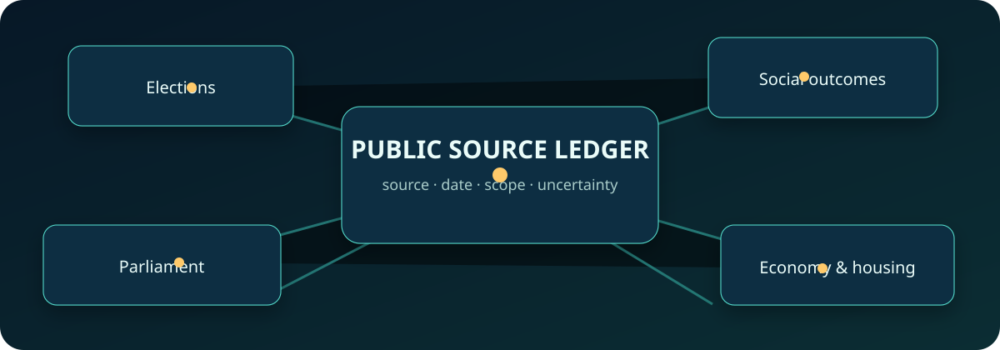

# NZ Election Evidence

[](https://github.com/thecolab-ai/nz-election-evidence/actions/workflows/validate.yml)

A community-maintained, nonpartisan map of New Zealand election evidence: what public sources exist, what a dated research snapshot contained, where the gaps are, and how to make claims that readers can trace back to publishers.

This is a practical starting point for **The Colab WhatsApp community** to work together without needing a database, ETL system or specialist software.

> **Accountability, independence, and pending review**
>
> Responsible project: **The Colab — NZ Election Evidence project**. Project maintainer/contact: **Adam Holt ([@adam91holt](https://github.com/adam91holt))**. This names the project and its maintainer; it does not claim that The Colab is an incorporated legal entity or that the maintainer has accepted a formal legal-review role. The responsible legal entity and an independent legal reviewer have not been confirmed.
>
> This is an independent project. It is **not affiliated with, endorsed by, or acting for the New Zealand Parliament, the Electoral Commission, or any political party or candidate**. The initial repository catalogue is an existing public surface and has **not completed legal review**. Technical changes and automated checks cannot complete the [R10 review gate](RED-LINES.md#r10--new-surface-new-review). See the [red lines](RED-LINES.md), [corrections log](CORRECTIONS.md), and [review register](REVIEW-REGISTER.md). These project notices are not legal advice.

Automation limit: a previously green CI status is **not a durable election-day merge lock**. On election day, repository owners must block merges and rerun the freeze check; the scheduled default-branch check cannot itself lock branch protection.



## What is here

- **24 dated source-product records**, mapped once each, totalling **351,710 distinct records in the 19 September 2026 snapshot**.
- A separate **52-lane research roadmap**. It is a plan, **not a claim that 52 datasets are complete**.
- Publisher links, observed timestamps, evidence types, counts, limitations and rights-review state.
- A self-contained [interactive evidence atlas](atlas/index.html).
- Dependency-free validation and metadata queries.

No copied PDFs, articles, full policy bodies, donor addresses, database exports, private history, credentials or operational infrastructure details are included. The initial dataset is deliberately **metadata-and-links only** while publisher rights are reviewed.

## Quick start (Python 3 only)

```bash
python3 scripts/validate.py
python3 -m unittest discover -s tests -v
python3 scripts/query.py --domain Elections
python3 scripts/query.py --roadmap-status held_snapshot
python3 -m http.server 8000
# Then open http://localhost:8000/atlas/
```

You can also open `atlas/index.html` directly. No packages, network access, server, database or API key are required.

## Evidence store and explorer (in review, not live)

This branch adds a Supabase evidence store, repeatable ingestion from official sources, and a **public read-only** explorer with no sign-in. The public layer is default deny: a dataset is projected only with provable source lineage, a pending publisher gets links and metadata only, content appears only for fields a publisher has approved, and anything withheld is listed with its reason. **This work is not complete**: 3 of 24 catalogue products have a live adapter, 1 (the 2023 candidacy product, 963 rows) imports through a pinned, verified export contract on a local disposable database only, and 20 have no route into the store. Two independent reviews returned NO-GO on earlier revisions and this revision addresses their bounded findings; a security re-review is incomplete, so nothing here is security signed off. **Nothing is published yet**: no migration has been applied to a hosted project, the database returns evidence rows to the public only once the R8 and R10 gates are recorded as open (both are closed), every publisher rights row is still pending, no schedule is active, and the GitHub Pages deployment is blocked until the [review register](REVIEW-REGISTER.md) records an approved review. The catalogue and atlas above still need no packages, network, server or API key.

- [Architecture](docs/database/architecture.md) · [Runbook and release checklist](docs/database/runbook.md) · [Source-by-source reconciliation](docs/database/source-reconciliation.md) · [Publication policy](docs/database/publication-policy.md) · [Implementation checklist](docs/database/implementation-checklist.md) · [Recommended branch protection](docs/database/branch-protection.md) · [Ingestion receipts](docs/database/receipts/README.md)
- `supabase/` — migrations, pgTAP tests, the `ingest-run` Edge Function and shared adapters
- `ingest/` — TypeScript CLI for dry runs, bounded live runs, backfills and reviewed export imports
- `tools/` — TypeScript release tooling: R10 deployment gate, receipt publisher, workflow invariant tests
- `web/` — the explorer (static shell; ships no evidence data; public anon key only; generated database types)
- `scripts/db/` — versioned operator SQL scripts

Coverage is partial and enumerated, not claimed: three live adapters exist (3 of 24 catalogue products), but after the PR 8 review only **one** is in use — the MP directory host's robots.txt disallows automated clients and the bills endpoint is undocumented, so both now stop as blocked until the publisher gives a route or permission; the Electoral Commission endpoints were unavailable to automated requests and are recorded as unavailable, which is not the same as empty.

## Start here

Read [FIRST-STEPS.md](FIRST-STEPS.md) for three bounded contributions that are ready to pick up. Roles include data research, source research, quality assurance, policy analysis and visualisation. See [CONTRIBUTING.md](CONTRIBUTING.md) before making evidence claims.

## Read the snapshot correctly

The count is a dated observation of a prior research snapshot, not a live counter and not proof of universal completeness. Capture timestamps describe when records were observed; they are not automatically the dates the underlying events occurred. Examples of important caveats:

- 17 party-policy records are **17 substantive policy URLs, not 17 manifestos**. The snapshot retained a preliminary model-assisted classification of 2 manifestos, 4 collections, 2 platforms and 9 hubs. Model name/version: **unknown**; schema/prompt: **unavailable**; confidence: **unavailable**; human review: **not yet completed**. Treat these historical labels as unreviewed, not verified findings; the catalogue links to the [publisher source](https://elections.nz/democracy-in-nz/political-parties-in-new-zealand/register-of-political-parties/).
- 12 poll records were held; methodology/sponsor disclosure was verified for 9, while 3 remained unresolved.
- 492 candidate-finance document records were held; 224 were image-only. This repository does not redistribute those PDFs.
- Written-question validation was still pending; its count is not a completeness certificate.

Read [methodology](docs/methodology.md), the [data dictionary](docs/data-dictionary.md), [coverage and limitations](docs/coverage-and-limitations.md), [data licensing](DATA-LICENSING.md), and the [sanitisation/publication-readiness report](docs/sanitization-report.md).

## Principles

1. **Primary sources first.** Cite the publisher page and a precise locator.
2. **Facts are not interpretations.** Label observations, classifications and inferences separately.
3. **Correlation is not causation.** A join, timeline or co-occurrence does not establish influence or effect.
4. **Unknown is not zero.** Use `unverified`, `unknown` or `not yet available` when evidence is incomplete.
5. **Minimise personal data.** No person profiling, donor addresses or unnecessary contact details.
6. **No party advocacy.** Apply the same methods and evidence standards across parties.

## Repository map

- `catalogue/sources.{json,csv}` — the 24-product dated catalogue
- `catalogue/roadmap.{json,csv}` — the separate 52-lane research roadmap
- `catalogue/rights-register.{json,csv}` — per-publisher review queue
- `catalogue/schema.json` — machine-readable catalogue contract
- `atlas/index.html` — self-contained static explorer
- `docs/` — methods, provenance, collaboration and project ideas
- `scripts/` and `tests/` — portable offline tooling
- `RED-LINES.md`, `CORRECTIONS.md`, and `REVIEW-REGISTER.md` — publication boundaries, correction history, and pending review gates

## Licence and citation

Original repository-authored code and documentation are MIT licensed. Third-party source material and data are **not** relicensed; see [DATA-LICENSING.md](DATA-LICENSING.md) and [THIRD_PARTY_NOTICES.md](THIRD_PARTY_NOTICES.md).

Suggested citation: *The Colab contributors, NZ Election Evidence, source-catalogue snapshot 2026-09-19, repository version/commit consulted.* Cite the underlying publisher too.
